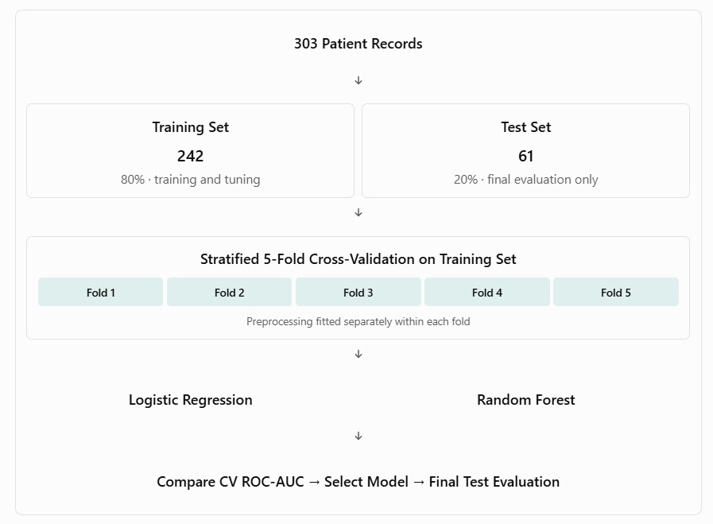
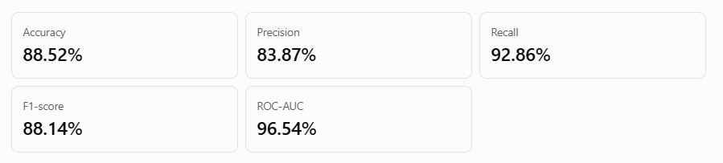
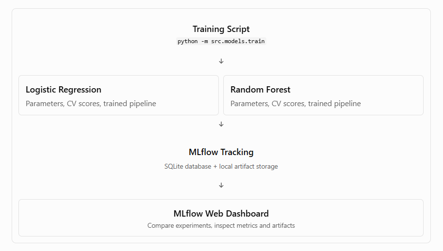

# Heart Disease Prediction - MLOps Project

End-to-end Machine Learning Operations project developed as part of the
M.Tech AI/ML MLOps assignment.

## Problem Statement

Build a machine learning classifier to predict the risk of heart disease
from patient health data and deploy the solution as a cloud-ready,
monitored API.

## Dataset

UCI Heart Disease Dataset.

## Project Objectives

The project demonstrates:

- Data acquisition and exploratory data analysis
- Data preprocessing and feature engineering
- Machine learning model development
- Cross-validation and hyperparameter tuning
- Experiment tracking using MLflow
- Model packaging and reproducibility
- Automated testing
- CI/CD using GitHub Actions
- REST API using FastAPI
- Docker containerization
- Kubernetes deployment
- Monitoring using Prometheus and Grafana

## Technology Stack

- Python
- Pandas / NumPy
- scikit-learn
- MLflow
- FastAPI
- pytest
- GitHub Actions
- Docker
- Kubernetes / Minikube
- Prometheus
- Grafana

## Preinstallation of Libararies:
pandas
numpy
scikit-learn
matplotlib
seaborn
jupyter
ucimlrepo
pytest
mlflow
fastapi
uvicorn
pydantic
prometheus-client
httpx
ruff
joblib

Commands to execute in sequence:
    
    python --version
    python -m venv .venv
    cmd: .\.venv\Scripts\Activate.ps1 / bash: source venv/bin/activate
    python -m pip install --upgrade pip
    pip install -r requirements.txt

Validate Installed Libraries:

    python -c "import pandas, sklearn, matplotlib, seaborn; print('Environment OK')"

    For Testing:
    pytest --version
    jupyter --version

## Task 1A — Reproducible Data Acquisition

    Download from UCI
       ↓
    Extract 13 features + target
       ↓
    Convert target to binary
       ↓
    Save reproducible CSV files

We accomplished Task 1:
“Obtain the dataset (provide download script or instructions)”

src/data/download.py
“Binary target presence/absence of heart disease”

Explicit conversion from UCI num to target
Production readiness / reproducibility

Dataset can be recreated on another machine using:

      python -m src.data.download
      python -c "import pandas as pd; df=pd.read_csv('data/processed/heart_disease.csv'); print(df.head()); print(df.shape);  print(df.dtypes)"
      python -c "import pandas as pd; df=pd.read_csv('data/processed/heart_disease.csv'); print(df.isnull().sum())"
      python -m src.data.validate

## Task 1B: Exploratory Data Analysis (In Note Book)
notebooks/01_eda.ipynb

    Dataset overview
      ↓
    Data types
      ↓
    Missing values
      ↓
    Duplicate rows
      ↓
    Summary statistics
      ↓
    Target/class balance
      ↓
    Numerical distributions
      ↓
    Categorical distributions
      ↓
    Feature vs target analysis
      ↓
    Correlation heatmap
      ↓
    EDA conclusions
      ↓
    Preprocessing decisions

## Task 2A — Reusable preprocessing pipeline

1. Create src/features/preprocess.py

- Numerical pipeline: Missing continuous values are replaced by the training-set median, followed by standardization.Standardization is particularly useful for Logistic Regression.

- Categorical pipeline: Missing categorical values are replaced by the most frequent training-set category. One-hot encoding prevents us from incorrectly implying an ordered numerical relationship between categories such as chest-pain types.

- handle_unknown="ignore": If the API later receives a valid category that was not present during training, the encoder will not crash. We'll still enforce known clinical category ranges separately in the API validation layer.

- sparse_output=False: Keeps the transformed dataset as a dense array, which is manageable for this small dataset.
Most importantly, build_preprocessor() returns an unfitted transformer. We do not call .fit() on the complete dataset.

2. Create unit tests for preprocessing tests/test_preprocessing.py

3. Run the unit tests 

            python -m pytest tests/test_preprocessing.py -v

4. Smoke Test the preprocessing on the real UCI dataset src/features/check_preprocessing.py

            python -m src.features.check_preprocessing

## Task 2B: Model Training, Hyperparameter Tuning, Cross-Validation, and Evaluation

Note: Install joblib (if not done yet)

1. Create src/models/evaluate.py
2. Create src/models/train.py

It will:
      i. Load the dataset.
      ii. Perform a stratified train/test split.
      iii. Construct a complete preprocessing-plus-classifier pipeline.
      iv. Tune both classifiers with stratified 5-fold CV.
      v. Compare their cross-validation ROC-AUC scores.
      vi. Select the best-performing model.
      vii. Evaluate it once on the held-out test set.
      viii. Save the complete pipeline and evaluation artifacts.

- GridSearchCV runs preprocessing inside each CV fold, avoiding leakage.
- n_jobs=-1 uses available CPU cores for the search. On a resource-limited Virtual Lab, we can change this to 1.
- refit=True automatically fits the best hyperparameter configuration on the full training split.
- The test set is not used to choose between Logistic Regression and Random Forest.
- The saved joblib artifact contains the entire fitted pipeline, not just the classifier.

      python -m src.models.train

3. Verify the saved artifacts under models/ and reports/model_evaluation
4. Add model tests tests/test_model.py

      python -m pytest tests/ -v

      Output:

            Training: logistic_regression
            Best CV ROC-AUC: 0.9028
            Best parameters: {'classifier__C': 0.1, 'classifier__class_weight': 'balanced'}

            Training: random_forest
            Best CV ROC-AUC: 0.8984
            Best parameters: {'classifier__max_depth': None, 'classifier__min_samples_split': 5, 'classifier__n_estimators': 100}

            Selected model: logistic_regression

            Held-out test metrics:
            accuracy: 0.8852
            precision: 0.8387
            recall: 0.9286
            f1: 0.8814
            roc_auc: 0.9654 
      

## Task 3 — MLflow Experiment Tracking

Component	            Technology
Experiment tracking	MLflow
Tracking database	      SQLite
Model serialization	MLflow + joblib
Artifacts	            Local filesystem
Experiment dashboard	MLflow UI

Note: Install mlflow (if not done yet)

      python -c "import mlflow; print(mlflow.__version__)"

1. Update src/models/train.py (add MLflow logging around the training loop)
      - Add imports
      - Configure the tracking store
      - Modify the model-training loop
      - Log final test results

2. Run training with MLflow

      python -m src.models.train

3. Open the MLflow dashboard

      mlflow ui --backend-store-uri ./mlruns --host 127.0.0.1 --port 5000

      - Each model gets its own MLflow run.
      - Hyperparameters and cross-validation results are logged.
      - Both trained pipelines are logged to MLflow.
      - Only the selected model gets final held-out test metrics.
      - Confusion matrix, ROC curve and CSV reports are attached to the selected run.
      - The selected model is exported to models/heart_disease_pipeline.joblib.

      In the dashboard, verify that:

      - The `heart-disease-classification` experiment exists.
      - Both Logistic Regression and Random Forest runs appear.
      - Both runs contain selected hyperparameters and CV ROC-AUC.
      - Both runs contain a saved model and CV results.
      - The selected model also contains test metrics, confusion matrix and ROC curve.

4. Verify the existing tests still pass

MLflow supports cloudpickle serialization for scikit-learn models. This avoids the skops trusted-type validation that is causing your error.
Security note: cloudpickle artifacts must only be loaded from trusted sources because deserialization can execute arbitrary code.