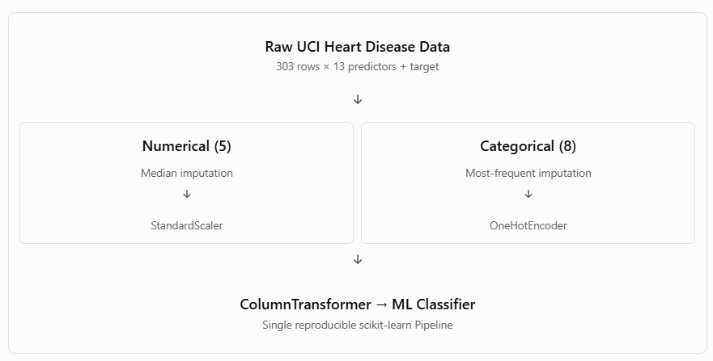

# Heart Disease Prediction - MLOps Project

End-to-end Machine Learning Operations project developed as part of the
M.Tech AI/ML MLOps assignment.

## Problem Statement

Build a machine learning classifier to predict the risk of heart disease
from patient health data and deploy the solution as a cloud-ready,
monitored API.

## Dataset

UCI Heart Disease Dataset.

## Project Objectives

The project demonstrates:

- Data acquisition and exploratory data analysis
- Data preprocessing and feature engineering
- Machine learning model development
- Cross-validation and hyperparameter tuning
- Experiment tracking using MLflow
- Model packaging and reproducibility
- Automated testing
- CI/CD using GitHub Actions
- REST API using FastAPI
- Docker containerization
- Kubernetes deployment
- Monitoring using Prometheus and Grafana

## Technology Stack

- Python
- Pandas / NumPy
- scikit-learn
- MLflow
- FastAPI
- pytest
- GitHub Actions
- Docker
- Kubernetes / Minikube
- Prometheus
- Grafana

## Preinstallation of Libararies:
pandas
numpy
scikit-learn
matplotlib
seaborn
jupyter
ucimlrepo
pytest
mlflow
fastapi
uvicorn
pydantic
prometheus-client
httpx
ruff

Commands to execute in sequence:
    
    python --version
    python -m venv .venv
    cmd: .\.venv\Scripts\Activate.ps1 / bash: source venv/bin/activate
    python -m pip install --upgrade pip
    pip install -r requirements.txt

Validate Installed Libraries:

    python -c "import pandas, sklearn, matplotlib, seaborn; print('Environment OK')"

    For Testing:
    pytest --version
    jupyter --version

## Task 1A — Reproducible Data Acquisition

    Download from UCI
       ↓
    Extract 13 features + target
       ↓
    Convert target to binary
       ↓
    Save reproducible CSV files

We accomplished Task 1:
“Obtain the dataset (provide download script or instructions)”

src/data/download.py
“Binary target presence/absence of heart disease”

Explicit conversion from UCI num to target
Production readiness / reproducibility

Dataset can be recreated on another machine using:

      python -m src.data.download
      python -c "import pandas as pd; df=pd.read_csv('data/processed/heart_disease.csv'); print(df.head()); print(df.shape);  print(df.dtypes)"
      python -c "import pandas as pd; df=pd.read_csv('data/processed/heart_disease.csv'); print(df.isnull().sum())"
      python -m src.data.validate

## Task 1B: Exploratory Data Analysis (In Note Book)
notebooks/01_eda.ipynb

    Dataset overview
      ↓
    Data types
      ↓
    Missing values
      ↓
    Duplicate rows
      ↓
    Summary statistics
      ↓
    Target/class balance
      ↓
    Numerical distributions
      ↓
    Categorical distributions
      ↓
    Feature vs target analysis
      ↓
    Correlation heatmap
      ↓
    EDA conclusions
      ↓
    Preprocessing decisions

## Task 2A — Reusable preprocessing pipeline

1. Create src/features/preprocess.py

Numerical pipeline: Missing continuous values are replaced by the training-set median, followed by standardization. Standardization is particularly useful for Logistic Regression.

Categorical pipeline: Missing categorical values are replaced by the most frequent training-set category. One-hot encoding prevents us from incorrectly implying an ordered numerical relationship between categories such as chest-pain types.

handle_unknown="ignore": If the API later receives a valid category that was not present during training, the encoder will not crash. We'll still enforce known clinical category ranges separately in the API validation layer.

sparse_output=False: Keeps the transformed dataset as a dense array, which is manageable for this small dataset.
Most importantly, build_preprocessor() returns an unfitted transformer. We do not call .fit() on the complete dataset.

2. Create unit tests for preprocessing tests/test_preprocessing.py

3. Run the unit tests 

      python -m pytest tests/test_preprocessing.py -v

4. Smoke Test the preprocessing on the real UCI dataset src/features/check_preprocessing.py

      python -m src.features.check_preprocessing

